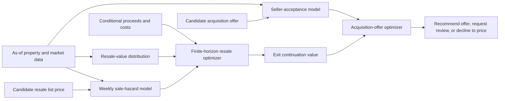

# Offer-to-Exit

**A transparent decision system for pricing a home from acquisition through resale.**

[](https://github.com/preston-monk/offer-to-exit/actions/workflows/ci.yml)
[](https://www.python.org/)

Offer-to-Exit answers one decision question:

> What is the highest acquisition offer worth making today when seller
> acceptance, resale value, time to sale, operating costs, and downside risk are
> uncertain?

The output is not just a value estimate. The system either recommends an offer,
requests human review when the inputs are invalid or poorly supported, or
declines to price when no supported offer clears the economic and risk
constraints. Conditional on acquisition, it also returns a constrained weekly
resale-pricing policy over a 17-week horizon.

> [!IMPORTANT]
> **Evidence boundary:** the public-data pipeline is real; the released
> experiment and every reported model or policy metric are semi-synthetic.
> Public records do not reveal the randomized acquisition offers and resale-price
> interventions needed to identify seller and buyer response. The release is
> therefore evidence about implementation, recovery of known simulated
> responses, and decision behavior—not evidence about any real operator or
> housing market.

This is an applied economics case study rather than a formal research paper, but
it follows the same discipline: state the economic setting, define the choice and
counterfactual, explain what the data can identify, solve the decision, and
separate the evidence from the claims. The code makes that argument executable
and auditable.

## Economic setting: a housing market maker with costly inventory

Offer-to-Exit treats a home acquisition operator as a balance-sheet
intermediary. It posts a bid to acquire a house, carries the house as inventory
if the seller accepts, and then posts an ask price to resell it. The expected
bid-ask spread must compensate the operator for repairs, transaction costs,
financing, inventory duration, valuation error, and downside risk.

| Stage | Choice | Economic tradeoff |
|---|---|---|
| Acquisition | Offer \(a\) | A higher offer raises seller acceptance but compresses the spread conditional on purchase. |
| Initial listing | Price \(p_0\) | A higher price raises proceeds conditional on sale but lowers the probability of selling quickly. |
| Unsold inventory | Hold or mark down | Waiting preserves upside but incurs holding costs and additional market exposure. |
| End of horizon | Terminal exit | A finite terminal value prevents the model from treating indefinite delay as free. |

The real question is:

> How much should we pay for a home, given the best way we expect to liquidate
> it, and once we own it, how aggressively should we price it through time?

### The buyer side: a posted price and a weekly sale hazard

The model does not follow a named buyer making an individual yes-or-no decision.
It represents aggregate buyer demand as a weekly sale hazard. For state \(s_t\)
and posted list price \(p_t\), the hazard is the probability that the home sells
during week \(t\), conditional on remaining unsold when the week begins:

\[
h_t(p_t \mid s_t)
=
\Pr\!\left(
\text{sale in week }t
\mid
\text{unsold at }t,\;p_t,\;s_t
\right).
\]

The operator posts \(p_t\). During the week, the home either sells or remains
inventory. A sale realizes net proceeds. No sale produces another week of
financing, taxes, maintenance, and market exposure, while reducing the time
remaining to exit.

The weekly pricing problem is represented by the Bellman recursion

\[
\begin{aligned}
V_t(s_t)=\max_{p_t\in\mathcal P(s_t)}\Big\{&
h_t(p_t\mid s_t)\,
\mathbb E[\text{net proceeds}_t\mid\text{sale}] \\
&+\left[1-h_t(p_t\mid s_t)\right]
\left[-H_t+V_{t+1}(s_{t+1})\right]
\Big\}.
\end{aligned}
\]

Here \(H_t\) is the cost of carrying the home for another week. The terminal
value at week 17 disciplines every earlier price. Backward induction compares
the value of selling now with the continuation value of remaining unsold.

That recursion contains the economic heart of the project:

- A higher list price increases proceeds conditional on sale.
- A higher list price may reduce the weekly sale hazard.
- Failing to sell creates a cost today and leaves an aging, risky asset tomorrow.
- The remaining horizon determines how valuable waiting still is.

### Why inventory duration matters

A house is a large, indivisible, illiquid unit of inventory. Getting it off the
balance sheet matters because delay has an opportunity cost even if the eventual
nominal sale price does not change. Holding the home ties up capital, incurs
financing and operating costs, creates exposure to falling prices, and increases
uncertainty about eventual proceeds.

A \$400,000 sale in three weeks and a \$400,000 sale in seventeen weeks are not
economically equivalent. The objective is not the highest eventual resale price.
It is the best risk-adjusted contribution value after time, costs, liquidity, and
uncertainty are priced.

### Why acquisition must incorporate resale

Before choosing the acquisition offer, the operator solves the resale problem
backward. This produces the continuation value of owning the home under the best
feasible exit policy. A stylized acquisition problem is

\[
\begin{aligned}
a^*=\arg\max_{a\in\mathcal A}\;&
q(a\mid x)\left[V_0^*(x)-a-R(x)-C(x)\right] \\
&-\lambda\,\operatorname{CVaR}_{0.95}
\!\left[-\Pi(a,\pi^*)\right].
\end{aligned}
\]

The term \(q(a\mid x)\) is the seller's acceptance probability. The continuation
value \(V_0^*(x)\) summarizes the best feasible resale path, including the
weekly probability of sale and holding costs. \(R(x)\) and \(C(x)\) denote repair
and transaction costs. CVaR is the average loss in the worst 5% of simulated
outcomes, and \(\lambda\) is an operator risk preference rather than a parameter
identified from the data.

A higher acquisition offer:

- raises the probability of acquiring the home;
- reduces the spread conditional on acquisition;
- leaves less protection against valuation and cost error; and
- makes the resale policy more sensitive to weak demand and long duration.

This is why acquisition pricing and resale pricing cannot be separate exercises.
The maximum offer worth making depends on the liquidity, costs, and downside risk
of the optimal exit path.

### What this is really about

Offer-to-Exit is a single-property dynamic inventory-pricing model for a
balance-sheet intermediary. Its closest economic relatives are dealer and
market-making models, dynamic pricing and revenue management, inventory theory,
search and bilateral bargaining, optimal stopping, duration modeling, and
stochastic dynamic programming.

The acquisition offer is the bid. The resale price is the ask. The current
project captures that logic for one home. It does not yet model portfolio capital
allocation, correlated inventory risk, geographic concentration, or balance-sheet
capacity. Those are the objects needed to move from a property-level decision to
a complete inventory-management problem.

## The linked decision system

The economic setting requires four uncertain objects:

1. a distribution of resale value at exit;
2. seller acceptance under each candidate acquisition offer;
3. weekly sale probability under each candidate resale list price; and
4. closing proceeds, repair cost, transaction cost, and cost of holding inventory.

For acquisition offer \(a\) and resale policy \(\pi\), the system searches for

\[
\max_{a,\pi}\; \mathbb{E}[\Pi(a,\pi)]
- \lambda\,\operatorname{CVaR}_{0.95}[-\Pi(a,\pi)].
\]

The continuation value of \(\pi\), the risk-adjusted value of the best feasible
resale path after acquisition, links the two decisions.



### One traceable decision

The worked cases are hand-constructed diagnostic scenarios, separate from the
480-home model-evaluation holdout. They test whether the decision layer behaves
sensibly under routine, high-carry, and weak-evidence conditions.

| Scenario | System action | Best supported offer | Acceptance | Expected profit / lead | Loss probability | First resale action |
|---|---|---:|---:|---:|---:|---|
| Healthy demand | **Recommend offer** | `$348,000` | `24.6%` | `$4,829` | `0.6%` | Hold |
| Stale inventory | **Decline to price** | `$510,000` diagnostic only | `23.1%` | `-$6,199` | `14.1%` | Cut `5%` if acquired |
| Thin comparables | **Decline to price** | `$266,500` diagnostic only | `17.8%` | `$852` | `3.6%` | Cut `2.5%` if acquired |

The thin-comparables case is intentionally instructive: a positive mean profit
does not imply an automated offer when uncertainty and tail loss make the
risk-adjusted objective non-positive. Inspect the full paths in the
[self-contained decision explorer](https://preston-monk.github.io/offer-to-exit/artifacts/release/demo.html).

## What is observed, generated, and identified?

| Layer | Release treatment | Supported interpretation |
|---|---|---|
| Public property and market pipeline | Six Phoenix/Maricopa sources with provenance, privacy filtering, and untracked raw data | Data engineering and descriptive market context |
| Released model experiment | Phoenix-shaped generated homes in independent training and evaluation environments | Predictive performance under the documented covariate shift |
| Seller acceptance | Randomized offer-to-value ratios with heterogeneous simulated preferences | Causal-response recovery inside the simulator |
| Weekly buyer demand | Randomized list-price premiums with right-censored sale outcomes | Causal-response recovery inside the simulator |
| Proceeds and costs | Transparent scenario distributions | Sensitivity and decision diagnostics |
| Policy outcomes | Three hand-constructed worked cases | Software and economic-behavior checks, not population lift |

The evaluation environment is one independently seeded covariate-shift check,
not broad robustness evidence. Relative to training, mean market heat moves from
`0.20` to `-0.18`, mean mortgage rates from `5.5%` to `6.9%`, and mean annual
appreciation from `3.0%` to `-0.5%`; value, square-footage, and submarket mixes
also shift.

## v0.1 evidence

The fitted components are evaluated on 480 generated homes held outside model
fitting. The weekly hazard evaluation retains 213 listings and 1,389
right-censored person-period observations.

| Component | Transparent baseline | v0.1 result | Interpretation |
|---|---:|---:|---|
| Resale valuation | Pooled-median MAE `$123,567` | Mean absolute error `$43,536`; median absolute error `$32,777` | `64.8%` lower mean absolute error under the shift |
| 90% value interval | None | `90.0%` coverage | Marginal coverage is calibrated; median width is `35.7%` of the prediction |
| Seller acceptance | Pooled-rate Brier `0.2469` | Brier `0.1965` | Probability accuracy inside the simulator |
| Weekly sale hazard | Period-only log loss `0.4025` | Log loss `0.3922` | Price-aware censored hazard improves on the period baseline |
| Offer response | Truth `+1.600` log-odds per +10 points | Fitted `+1.337` | Known simulated response recovered with `0.263` absolute error |
| Resale-price response | Truth `-1.200` log-odds per +10 points | Fitted `-1.177` | Known simulated response recovered with `0.023` absolute error |

The important result is not a spectacular simulated lift. It is that each link
is inspectable: what was known at decision time, what was predicted, what was
simulated, how uncertainty entered the decision, and when the system refused to
act. See the [complete evidence table](reports/results.md) and
[versioned manifest](artifacts/release/run_manifest.v1.json).

## Why these methods?

- **Split-conformal valuation intervals** expose uncertainty to the optimizer
  instead of reducing value to one point estimate.
- **Discrete-time survival modeling** represents weekly sale probability while
  retaining homes that remain unsold at the horizon.
- **Separate sale hazard and proceeds** preserve the distinction between whether
  a home sells and the amount realized conditional on sale.
- **Finite-horizon dynamic programming** is auditable for a small action grid and
  handles hard pricing and cadence constraints directly.
- **Structured response models** make extrapolation and monotonicity easier to
  inspect than a flexible black box entering an optimizer.
- **Review and decline states** reduce automated coverage when data quality,
  support, or risk is inadequate.

## Reproduce the release

The complete released experiment runs locally from a locked environment:

```bash
make install
make reproduce
```

Run the full quality suite—formatting, linting, static types, tests with coverage,
and the deterministic quickstart—with:

```bash
make check
```

The repository also exposes a typed API over the worked cases:

```bash
uv run uvicorn offer_to_exit.serving:app --reload
```

The public-data path is deliberately separate from the released generated
experiment:

```bash
uv run offer-to-exit catalog
uv run offer-to-exit fetch
uv run offer-to-exit prepare
```

Preparation streams allowlisted Maricopa fields, hashes parcel identifiers, and
fails closed on owner- or address-like columns. Raw and full processed data stay
outside version control.

## Current scope

- Phoenix/Maricopa-shaped single-family homes;
- one acquisition decision and weekly resale decisions for 17 weeks;
- hold or reduce list price by 1%, 2.5%, or 5%;
- calibrated linear valuation, regularized logistic seller acceptance, and a
  discrete-time logistic sale hazard;
- transparent proceeds and cost scenarios rather than a learned proceeds model;
- one independently seeded covariate-shifted evaluation environment; and
- three diagnostic decision cases with executable economic invariants.

The release does not report real-market elasticity or economic lift, repeated
policy backtests, bootstrap uncertainty, geography-slice results, stress-suite
results, oracle regret, portfolio allocation, or production readiness.

## Repository map

```text
configs/              Executed quickstart and release configurations
data/                 Public-source contract and untracked local data zones
docs/                  Methodology for the linked decision system
src/offer_to_exit/    Simulation, modeling, optimization, evaluation, and serving
tests/                 Temporal, privacy, decision, and integration checks
reports/               Data/model/policy cards, evidence, and limitations
artifacts/release/     Deterministic tables, figures, manifest, and static explorer
```

## Go deeper

- [Understand the method](docs/METHODS.md)
- [Inspect the evidence](reports/results.md)
- [Review assumptions and failure modes](reports/limitations.md)
- [Read the decision contract](SYSTEM_SPEC.md)

Code is released under the [MIT License](LICENSE). External datasets retain
their original terms and are not relicensed by this repository. Citation metadata
is in [CITATION.cff](CITATION.cff).
