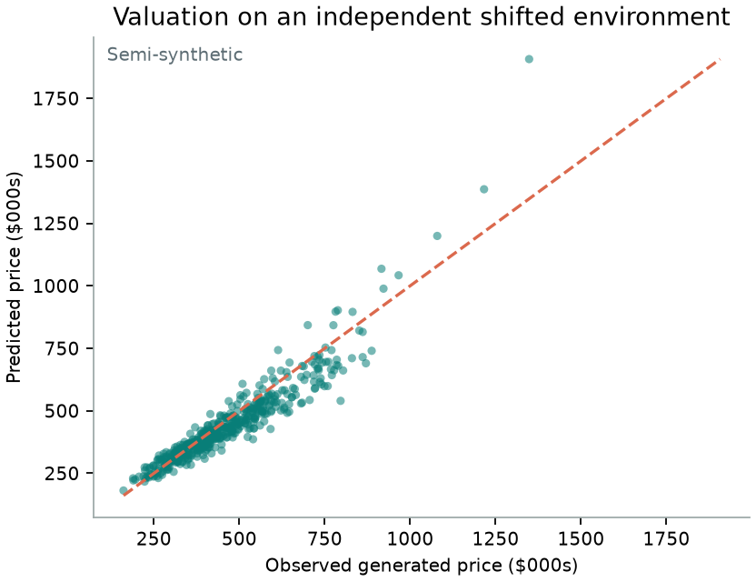
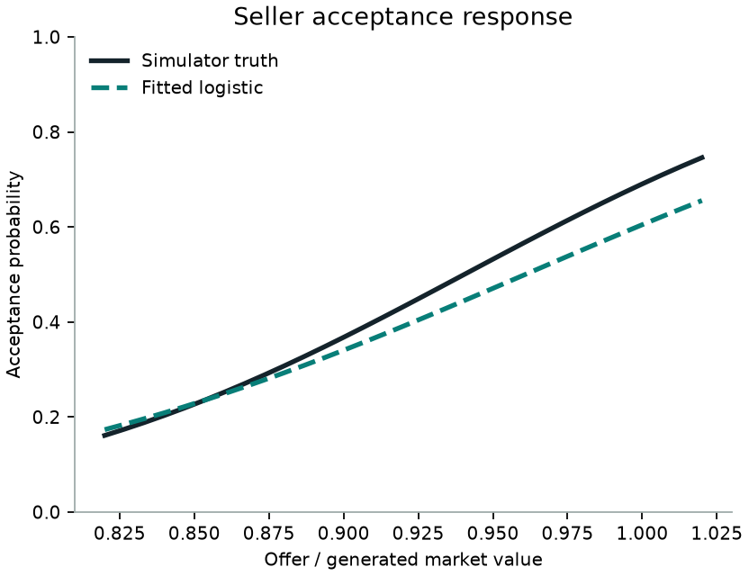
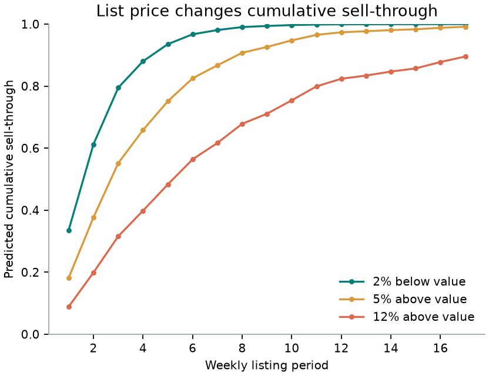

# v0.1 Release Evidence

## Claim boundary

These are deterministic **semi-synthetic results** from one independently seeded,
covariate-shifted evaluation environment. They are not estimates of a real
operator, homeowner population, housing market, or economic impact. The public
Phoenix/Maricopa pipeline is separate; every fitted result below uses generated
data so the behavioral counterfactual truth is known.

## Reproducibility header

| Field | Release value |
|---|---|
| Package | `offer-to-exit 0.1.0` |
| Run | `release-seed-20260901-schema-1` |
| Configuration | [`configs/release.yaml`](../configs/release.yaml) |
| Configuration SHA-256 | `7478ddc9750a3b673c7cc8f672712c249908afe49c58cdfd3561cbd34d44c479` |
| Training / evaluation seeds | `1129` / `4079` |
| Training / evaluation homes | `720` / `480` |
| Evaluation listings / person-periods | `213` / `1,389` |
| Decision cadence / horizon | weekly / 17 periods |
| Manifest | [`artifacts/release/run_manifest.v1.json`](../artifacts/release/run_manifest.v1.json) |

The manifest records a checksum for every emitted JSON, CSV, PNG, and HTML
artifact. The integration test runs the pipeline twice and asserts byte-stable
metrics, decisions, and figures.

## Independent-evaluation results

| Component | Baseline | Baseline result | v0.1 result | Interpretation |
|---|---|---:|---:|---|
| Exit valuation | Pooled training median | MAE `$123,567` | MAE `$43,536` | `64.8%` lower MAE on shifted generated homes |
| Exit interval | None | — | `90.0%` coverage at `90%` nominal | Median width is `35.7%` of prediction; uncertainty is material |
| Seller acceptance | Pooled training rate | Brier `0.2469` | Brier `0.1965` | Simulated behavior only; 10-bin ECE is `0.0561` |
| Weekly sale hazard | Period-only hazard | Log loss `0.4025` | Log loss `0.3922` | Right-censored person-period evaluation |

### Known-response recovery

| Treatment | Simulator truth | Fitted effect | Absolute error | Monotone? |
|---|---:|---:|---:|---|
| +10 percentage points in offer/value | `+1.600` log-odds | `+1.337` | `0.263` | Yes |
| +10 percentage points of list overpricing | `-1.200` log-odds | `-1.177` | `0.023` | Yes |

Truth is used for evaluation only, never as a fitting input. This recovery is a
simulator diagnostic, not a real elasticity estimate.

## Three traceable diagnostic decisions

These cases are hand-constructed stress scenarios solved by the decision module.
They are not sampled from the 480-home evaluation holdout and are not a population
policy backtest.

| Case | Gate | Best grid offer | First exit action | Acceptance | Profit / lead | Loss probability | Downside CVaR loss |
|---|---|---:|---|---:|---:|---:|---:|
| Healthy demand / margin protection | **Price** | `$348,000` | Hold | `24.6%` | `$4,829` | `0.6%` | `$564` |
| Stale inventory / high carry | **Abstain** | `$510,000` diagnostic only | Cut `5%` if acquired | `23.1%` | `-$6,199` | `14.1%` | `$61,419` |
| Thin comps / downside protection | **Abstain** | `$266,500` diagnostic only | Cut `2.5%` if acquired | `17.8%` | `$852` | `3.6%` | `$9,086` |

The stale and thin-comps rows demonstrate the decision gate: an optimizer may
identify the least-bad supported offer while the action layer still returns no
automated offer when risk-adjusted value is non-positive. Full paths are in
[`decision_cases.v1.csv`](../artifacts/release/decision_cases.v1.csv) and the
[static decision explorer](../artifacts/release/demo.html).

## Figures

## What v0.1 does not claim

- No real-world price elasticity or economic lift.
- No repeated full-policy comparison, bootstrap uncertainty, or oracle regret.
- No overlap-stratified or geography-slice result.
- No stress-suite result, learned sale-proceeds model, portfolio allocator, or
  production deployment.

Those measurements remain unimplemented. The evidence table leaves them absent
rather than substituting unsupported numbers.
